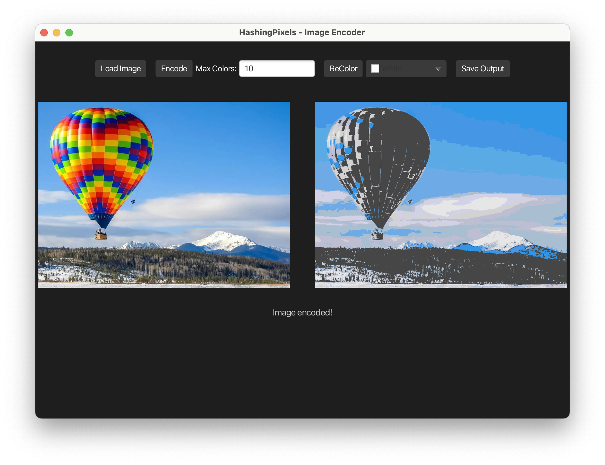
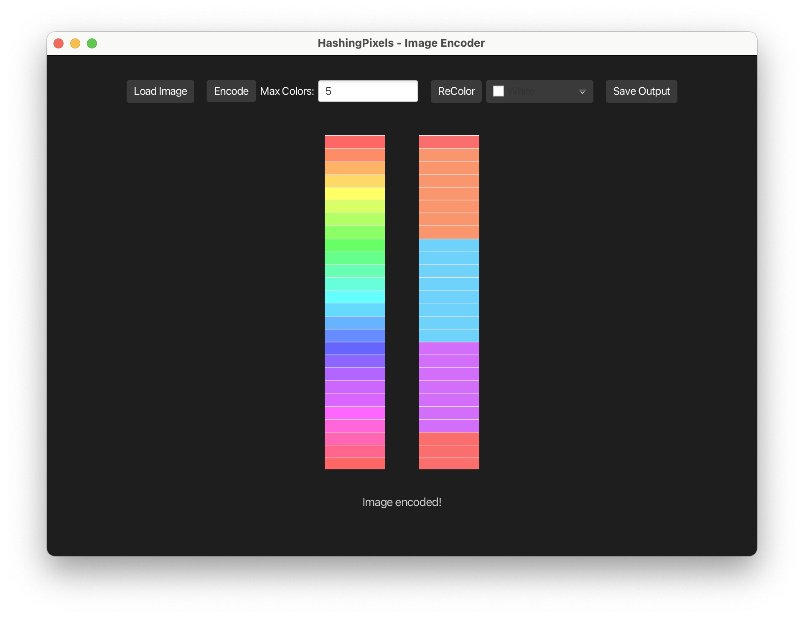
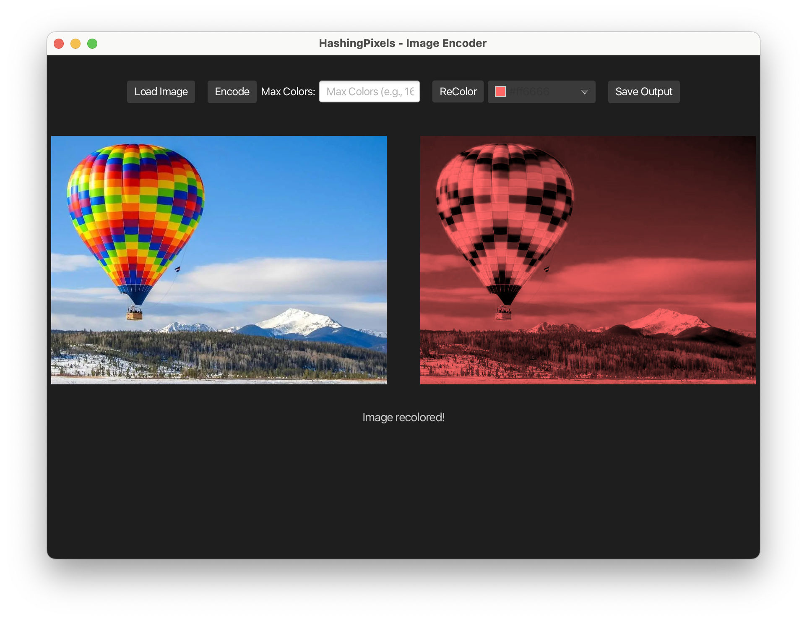

# HashingPixels

A Java application that loads an image, compresses its color palette to a limited number of colors using a custom-built hashtable, and allows users to recolor the image interactively through a JavaFX GUI.

## Features

- Load and view any PNG image
- Encode the image to use a limited number of colors with a custom hashtable (quadratic probing)
- Recolor the image using a new color palette
- Compare the original and transformed images side-by-side
- Easy-to-use JavaFX GUI

## How It Works

When an image is loaded, each pixel's color is hashed into a custom-built hashtable based on its RGB values. Duplicate colors are detected efficiently using quadratic probing, and occurrences are counted. The most common colors are then selected to form a reduced color palette, allowing the image to be encoded with fewer unique colors while preserving overall appearance.



The recoloring process lets users choose new colors to replace the dominant ones, offering creative flexibility.

This project demonstrates strong understanding of data structures, algorithm optimization, and image processing techniques.

## Why I Built This

I wanted to create a project that combined algorithmic problem-solving with creative visual results. By building my own hashtable implementation and applying it to real-world image data, I was able to strengthen my understanding of hashing, collision resolution, and efficient data processing. I also wanted to challenge myself by building a full GUI from scratch using JavaFX, giving users an interactive way to explore the effects of encoding and recoloring images.

## Installation

1. **Clone the repository**:
   ```bash
   git clone https://github.com/yourusername/HashingPixels.git
   cd HashingPixels
   ```

2. **Run the application** (Terminal only):
   ```bash
   ./gradlew run
   ```

> **Note**: Requires Java 21 and Gradle installed. JavaFX libraries are automatically managed via Gradle.

## Usage

- Open the app.
- Click **Load Image** to upload a PNG file.
- Set the **Max Colors** value.
- Click **Encode** to reduce the image's colors.
- (Optional) Select new colors and click **Recolor**.
- View and save the transformed image.




## Project Structure

- `logic/` - Image processing and hashing logic
- `gui/` - JavaFX application interface
- `test/` - Unit tests for logic components

## Dependencies

- Java 21
- JavaFX
- Gradle

## Future Improvements

- Allow users to export recolored images in different formats (e.g., JPEG, BMP)
- Add drag-and-drop image loading support
- Implement adjustable compression settings (e.g., dynamic cube size)
- Improve UI responsiveness for very large images
- Expand test coverage for GUI interactions

## Credits

Created by Alec Zaitz 🏄‍♂️
